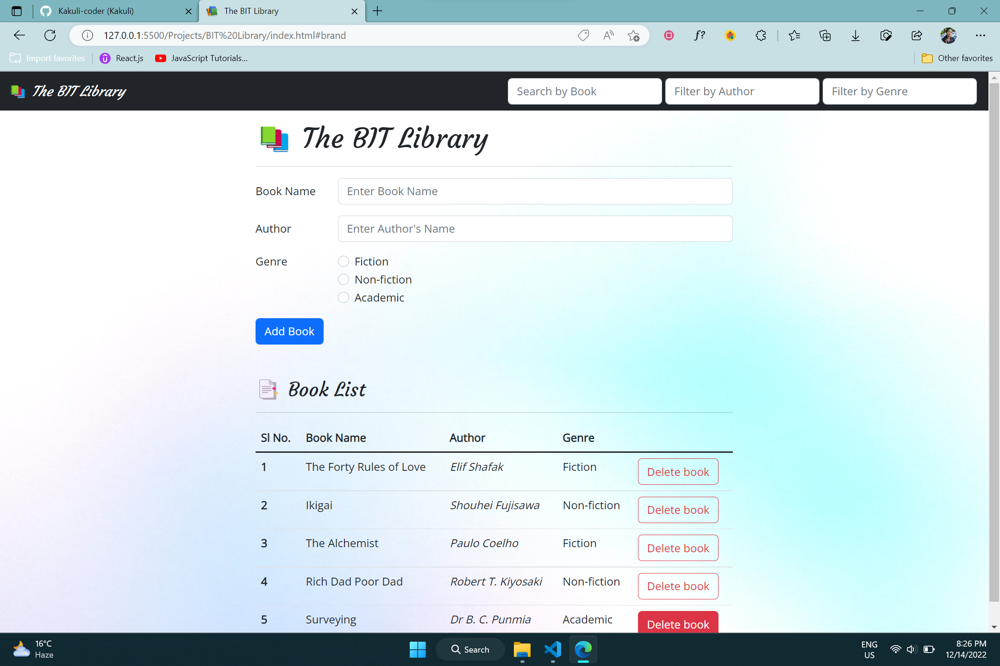

# 📚 The BIT Library

This website lets you keep a record of all the books that are available in The BIT Library with the names of their authors and genres.  

Click <a href="https://Kakuli-coder.github.io/The-BIT-Library/" alt="The BIT Library website" target="_blank">here</a> to go to *The BIT Library* Website.  

The BIT Library Preview 👇

✔️ Features:   

🔹Add new books.  
🔹Delete books that are issued.  
🔹Filter available books by their names, authors or genres.  
